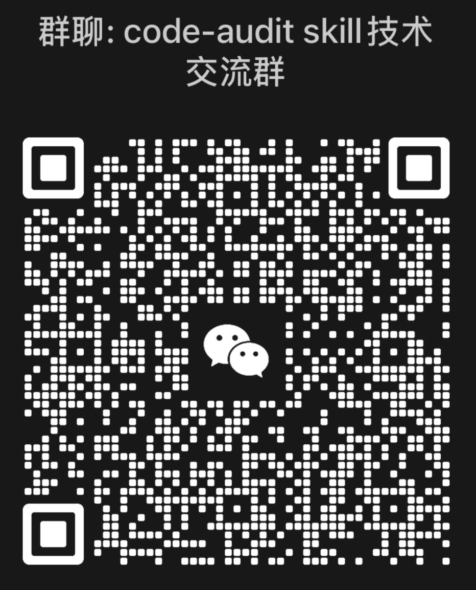

# Code Audit Skill for Claude Code

> Professional white-box code security audit skill with 55+ vulnerability types, dual-track audit model, and multi-agent deep analysis.

[中文文档](README_CN.md)

## Overview

Code Audit is a professional security audit skill for [Claude Code](https://docs.anthropic.com/en/docs/claude-code). It performs static white-box analysis to systematically discover and verify security vulnerabilities in source code.

### Key Features

- **9 Languages**: Java, Python, Go, PHP, JavaScript/Node.js, C/C++, .NET/C#, Ruby, Rust
- **14 Frameworks**: Spring Boot, Django, Flask, FastAPI, Express, Koa, Gin, Laravel, Rails, ASP.NET Core, Rust Web, NestJS/Fastify, MyBatis
- **55+ Vulnerability Types**: SQL injection, RCE, deserialization, SSRF, SSTI, XXE, IDOR, race conditions, business logic flaws, and more
- **143 Mandatory Detection Items**: Language-specific checklists across 10 security dimensions (D1-D10)
- **Dual-Track Audit Model**: Sink-driven for injection/RCE + Control-driven for authorization/business logic
- **Multi-Agent Deep Analysis**: Parallel agent execution for large codebases (874+ Java files in ~15 min)
- **WooYun Case Library**: 88,636 real-world vulnerability cases (2010-2016) for pattern reference
- **Attack Chain Construction**: Automatic chaining of findings into exploitable attack paths

## Installation

```bash
# Clone to Claude Code skills directory
cp -r code-audit ~/.claude/skills/

# Or clone from repository
cd ~/.claude/skills
git clone <repository-url> code-audit
```

The skill activates automatically when you request security audits in Claude Code.

## Usage

### Trigger Phrases

```
"Audit this project"
"Check code security"
"Find security vulnerabilities"
"/audit" or "/code-audit"
```

### Scan Modes

| Mode | Use Case | Scope |
|------|----------|-------|
| **Quick** | CI/CD, small projects | High-risk vulns, secrets, dependency CVEs |
| **Standard** | Regular audits | OWASP Top 10, auth, crypto, 1-2 rounds |
| **Deep** | Critical projects, pentests | Full coverage, attack chains, business logic, 2-3 rounds |

### Example

```
User: /code-audit deep /path/to/project

Claude: [MODE] deep
        [RECON] 874 files, Spring Boot 1.5 + Shiro 1.6 + JPA + Freemarker
        [PLAN] 5 Agents, D1-D10 coverage, estimated 125 turns
        ... (user confirms) ...
        [REPORT] 10 Critical, 14 High, 12 Medium, 4 Low
```

## Architecture

### Dual-Track Audit Model

Different vulnerability types require fundamentally different detection strategies:

| Track | Dimensions | Method | What It Finds |
|-------|-----------|--------|---------------|
| **Sink-driven** | D1 (Injection), D4 (Deserialization), D5 (File Ops), D6 (SSRF) | Grep dangerous patterns -> trace data flow -> verify no defense | Dangerous code that exists |
| **Control-driven** | D3 (Authorization), D9 (Business Logic) | Enumerate endpoints -> verify security controls exist -> missing = vuln | Security controls that are **absent** |
| **Config-driven** | D2 (Auth), D7 (Crypto), D8 (Config), D10 (Supply Chain) | Search configs -> compare against baseline | Misconfigurations |

### 10 Security Dimensions

| # | Dimension | Coverage |
|---|-----------|----------|
| D1 | Injection | SQL/Cmd/LDAP/SSTI/SpEL/JNDI |
| D2 | Authentication | Token/Session/JWT/Filter chain |
| D3 | Authorization | CRUD permission consistency, IDOR |
| D4 | Deserialization | Java/Python/PHP gadget chains |
| D5 | File Operations | Upload/download/path traversal |
| D6 | SSRF | URL injection, protocol restriction |
| D7 | Cryptography | Key management, cipher modes, KDF |
| D8 | Configuration | Actuator, CORS, error exposure |
| D9 | Business Logic | Race conditions, mass assignment, state machine, multi-tenant |
| D10 | Supply Chain | Dependency CVEs, version checks |

### Multi-Agent Workflow

```
Phase 1: Reconnaissance
  -> Tech stack identification
  -> Attack surface mapping (5-layer deduction)
  -> Endpoint-Permission Matrix generation
  -> Agent allocation

Phase 2: Parallel Agent Execution (R1)
  -> Agent 1: Injection (D1) [sink-driven]
  -> Agent 2: Auth + AuthZ + Business Logic (D2+D3+D9) [control-driven]
  -> Agent 3: File + SSRF (D5+D6) [sink-driven]
  -> Agent 4: Deserialization (D4) [sink-driven]
  -> Agent 5: Config + Crypto + Supply Chain (D7+D8+D10) [config-driven]

Phase 3: Coverage Evaluation
  -> Per-track coverage metrics (fanout rate / endpoint audit rate)
  -> Gap identification -> R2 supplemental agents if needed

Phase 4: Report Generation
  -> Severity calibration (decision tree)
  -> Cross-agent deduplication
  -> Attack chain construction
```

## File Structure

```
code-audit/
├── SKILL.md                    # Skill entry point (frontmatter + execution controller)
├── agent.md                    # Agent workflow (state machine + dual-track model)
├── README.md                   # Documentation (English)
├── README_CN.md                # Documentation (Chinese)
└── references/
    ├── core/              (16) # Core methodology
    │   ├── phase2_deep_methodology.md   # Dual-track audit methodology
    │   ├── taint_analysis.md            # Data flow tracking
    │   ├── anti_hallucination.md        # False positive prevention
    │   └── ...
    ├── checklists/        (11) # D1-D10 coverage matrix + 9 language checklists
    ├── languages/         (18) # Language vulnerability patterns
    ├── security/          (21) # Security domain modules
    ├── frameworks/        (14) # Framework-specific modules
    ├── adapters/           (5) # Language adapters (YAML)
    ├── wooyun/             (9) # WooYun real-world case library
    ├── cases/              (1) # Real vulnerability cases
    └── reporting/          (1) # Report templates
```

## Anti-Hallucination

Every finding must be based on actual code read via tools:

- File paths must be verified with Glob/Read before reporting
- Code snippets must come from actual Read tool output
- No guessing based on "typical project structure"
- **Core principle: Better to miss a vulnerability than report a false positive**

## Supported Technologies

### Languages
Java, Python, Go, PHP, JavaScript/TypeScript, C/C++, C#/.NET, Ruby, Rust

### Frameworks
Spring Boot, Django, Flask, FastAPI, Express, Koa, Gin, Laravel, Rails, ASP.NET Core, NestJS, Fastify, Rust Web (Actix/Axum)

### Security Domains
API Security, LLM/AI Security, Serverless, Cryptography, Race Conditions, OAuth/OIDC/SAML, WebSocket/gRPC, HTTP Smuggling, Supply Chain/CI-CD

## Contributing

Contributions welcome! To add support for a new language or framework:

1. Create `references/languages/{language}.md` or `references/frameworks/{framework}.md`
2. Follow existing module format (key questions per D1-D10 dimension)
3. Include: dangerous functions, detection patterns, vulnerability examples, secure alternatives
4. Update `agent.md` tech stack routing table if needed

## References

- [Code Audit Skill 详解（上）](https://mp.weixin.qq.com/s/K5yJ9nPUzwpBV5rMPPKfCg)
- [Code Audit Skill 详解（下）](https://mp.weixin.qq.com/s/yTPehTfk1ufv3RXq6gh1mA)

## Community

Join our WeChat group for discussion and support:



## License

MIT License

## Disclaimer

This skill is intended for **authorized security testing** only. Users must:
- Have legal authorization to audit the target code
- Responsibly disclose discovered vulnerabilities
- Comply with applicable laws and ethical guidelines

Unauthorized security testing of systems you do not own may be illegal.
